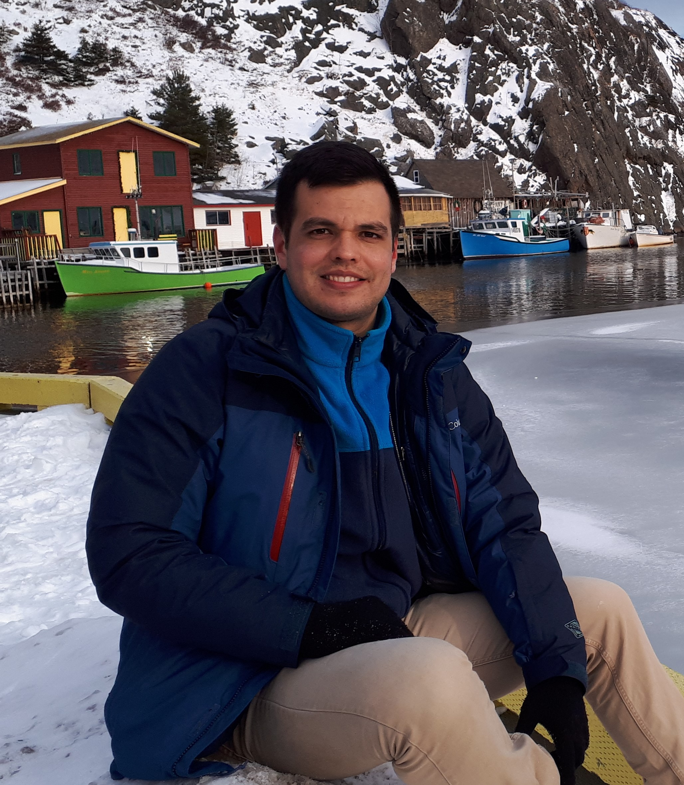

<!-- Global site tag (gtag.js) - Google Analytics -->

<link rel="stylesheet" href="styles.css" type="text/css">

### Andrés Beita-Jiménez

##### I am a marine biologist and quantitative fisheries scientist. Currently, I am studying a M.Sc. in Fisheries Science focused on Stock Assessment at the [Fisheries and Marine Institute](https://www.mi.mun.ca/), [Memorial University of Newfoundland](https://www.mun.ca/), Canada.

##### My academic interest are:

##### - Fisheries assessment and management
##### - Quantitative marine ecology
##### - Biostatistics
##### - Fish ecology
##### - Coral reef ecology

##### I am originally from Costa Rica, where I graduated with a Bachelor's degree in Biology at the [University of Costa Rica](https://www.ucr.ac.cr/). My full CV is available [here](files/CVBeitaJimenezMay2019_En.pdf).

