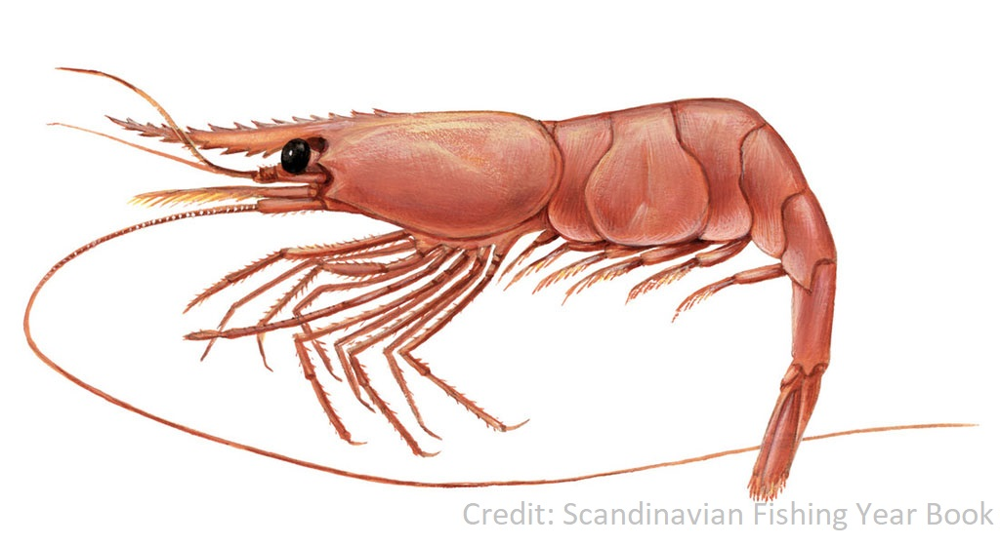
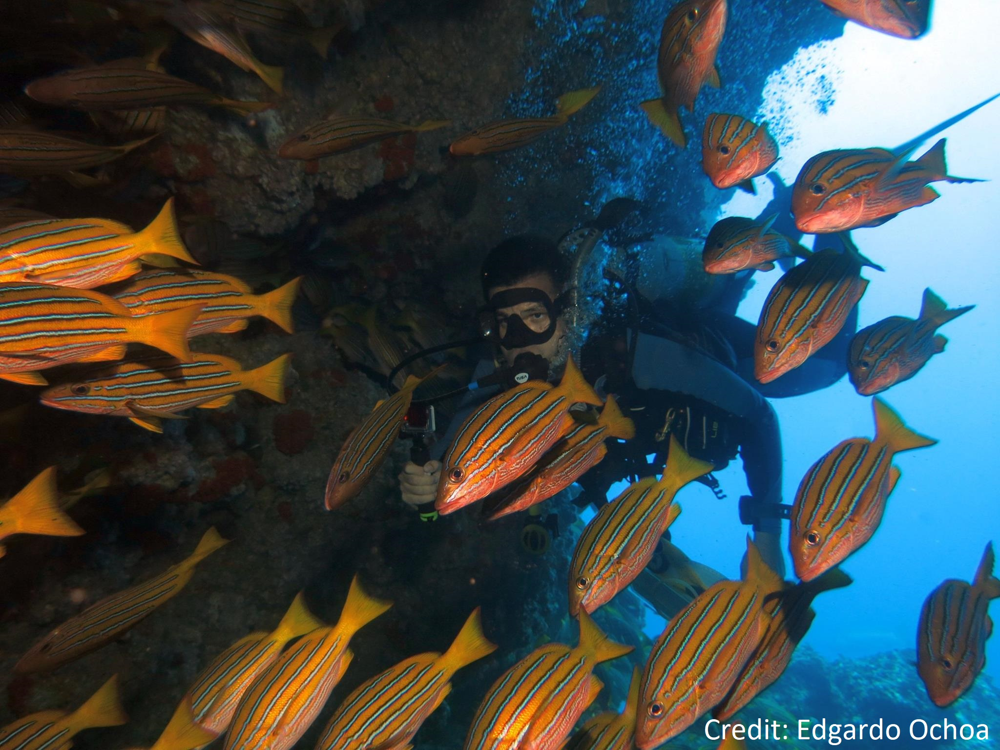

### Current Research

 

##### Numerous stock collapses worldwide have revealed that declines in stock productivity are often preceded or accompanied by significant changes in species life history traits. Northern shrimp (*Pandalus borealis*) has been one of the most economically valuable fisheries since the collapse of the northern cod. However, this stock is now experiencing a sharp decrease in productivity with important socio-economic consequences for coastal communities in the region. In my thesis research, I am examining if the changes in some life-history traits (eg. size of sexual transition, size structure, and fecundity) could be affecting the reproductive potential of the stock. I am also evaluating if the fishing pressure or the environment are factors that can help to explain that variability. 

### Previous Research

##### During my undergraduate, my research was focused on reef fish coloration ([Beita-Jiménez & Alvarado 2016](files/Beita&Alvarado2016.pdf)), behavior ([Auster et al. 2019](http://www.scielo.br/pdf/ni/v17n1/1982-0224-ni-17-01-e180165.pdf)), ecology (Alvarado et al. [2015](files/Alvaradoetal2015-osa.pdf), [2016](files/Alvaradoetal2016-isladelcoco.pdf), [2018](files/Alvaradoetal2018-Cuando la conservacion.pdf)) and management ([Villalobos-Rojas, et al. 2014](files/Villalobos-Rojasetal2014.pdf), [Beita-Jiménez et al. 2019](files/Beitaetal2019_FishNorthPacific_OceansCoastalMngmt.pdf)). With a team from the Center for Research in Marine Sciences and Limnology ([CIMAR](http://www.cimar.ucr.ac.cr/)), we described the structure of the coral reefs in different areas in the Pacific of Costa Rica. In my most recent paper ([Beita-Jiménez et al. 2019](files/Beitaetal2019_FishNorthPacific_OceansCoastalMngmt.pdf)), we evaluated the effectiveness of some marine protected areas (MPAs) in the North Pacific of Costa Rica. We found a positive but limited effect of the MPAs on the fish assemblages, suggesting that they are promising management measures but there is a need for improvement of regulations in and out of MPAs in order to assure the ecosystem services and life quality of coastal populations. See my list of publications for more details. 

